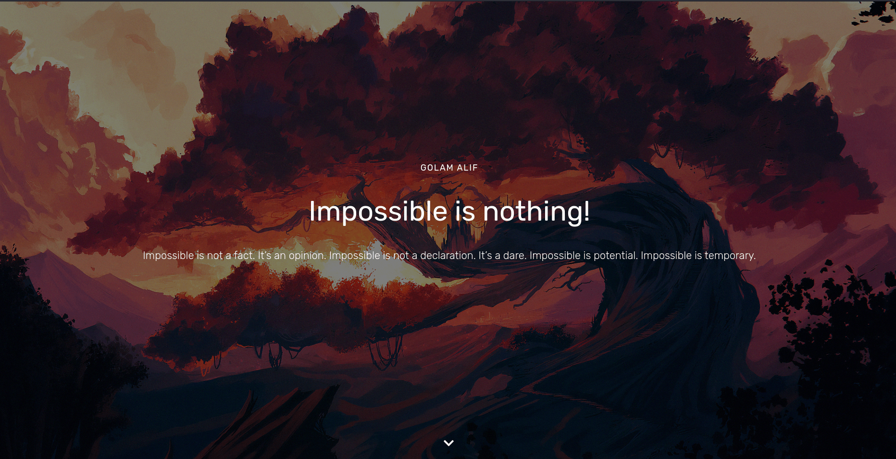
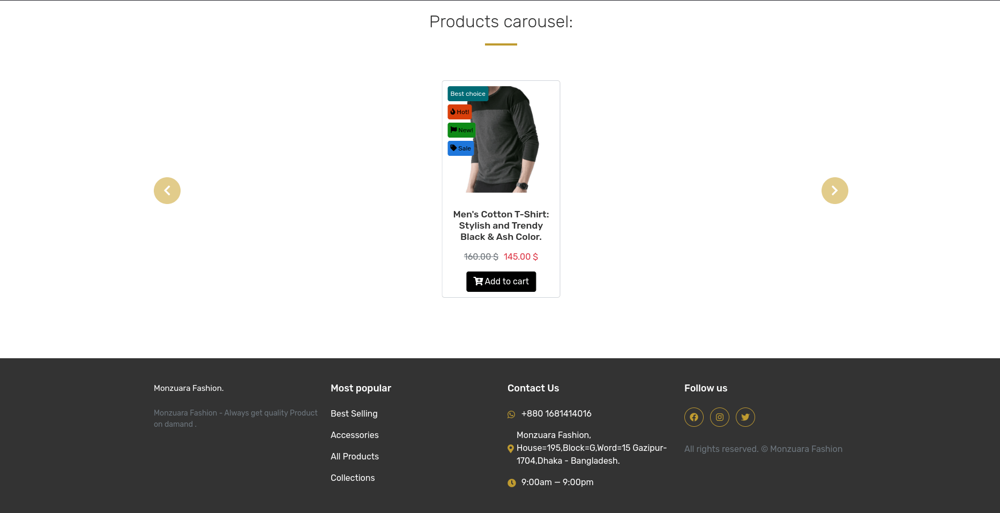

# Monzuara Fashion Website

Welcome to the Monzuara Fashion website repository! This project contains the source code for the Monzuara Fashion website, an online platform dedicated to showcasing our high-quality apparel and accessories.

## About

Monzuara Fashion is a fashion brand that started in 2019 with a vision to provide stylish and high-quality clothing and accessories. Our mini factory, located in Gazipur, Dhaka, is equipped with state-of-the-art machines, and our team is dedicated to crafting unique and comfortable fashion pieces.

## Features

- **About Us Section:** Learn about our journey, global presence, and commitment to quality.
- **Product Showcase:** Browse through a diverse range of high-quality wearable items.
- **Google Map Integration:** Locate our factory in Gazipur, Dhaka, through the embedded Google Map.
- **Responsive Design:** The website is optimized for a seamless experience across various devices.

## Getting Started

To get a copy of the project up and running on your local machine, follow these steps:

1. **Clone the repository:**
   ```bash
   git clone https://github.com/your-username/monzuara-fashion-website.git
   ```
2. **Navigate to the project directory::**

   ```bash
   	cd monzuara-fashion-website

   ```

   Install dependencies using Yarn:

```bash
yarn install
```

Start the development server:

```bash
yarn dev
```

The website should now be accessible at http://localhost:3000.

Tech Stack
Node.js
React
Sass
JavaScript
Tailwind CSS
Yarn
Headless CMS
Contributing
We welcome contributions! If you find a bug or have a feature request, please open an issue. Pull requests are also encouraged. For major changes, please open an issue first to discuss what you would like to change.






## License

This project is not licensed under any open source licenses. It is proprietary and all rights are reserved. See the LICENSE.md file for details.
Copyright (c) 2023 Golam ALif

## All rights reserved.

No part of this software and associated documentation files (the "Software"), may be reproduced, stored in a retrieval system or transmitted in any form or by any means, electronic, mechanical, photocopying, recording, or otherwise, without the prior written permission of the author.

The Software is provided "as is", without warranty of any kind, express or implied, including but not limited to the warranties of merchantability, fitness for a particular purpose and noninfringement. In no event shall the authors or copyright holders be liable for any claim, damages or other liability, whether in an action of contract, tort or otherwise, arising from, out of or in connection with the Software or the use or other dealings in the Software.
